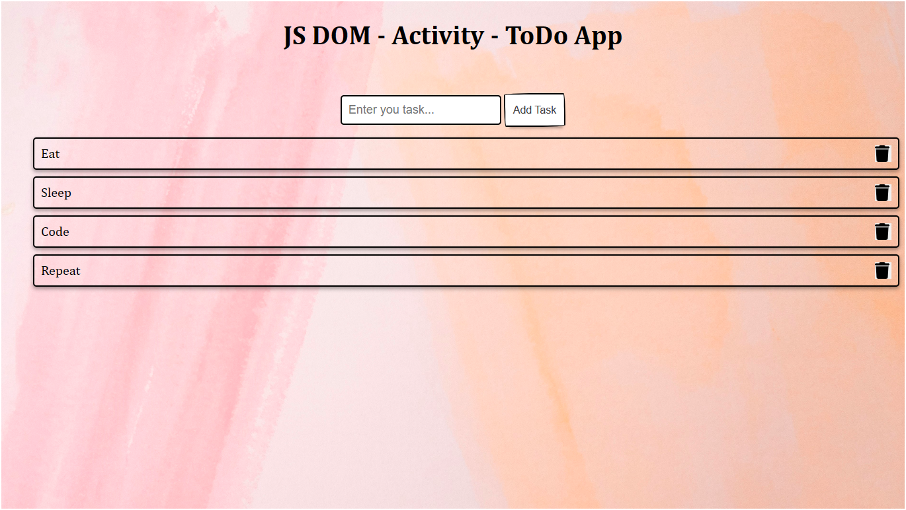

# ToDo App

This is a simple ToDo application where you can add tasks to a list and mark them as completed or delete them.

## Table of Contents

- [Introduction](#introduction)
- [Features](#features)
- [Instructions](#instructions)
- [Demo](#demo)
- [Technologies Used](#technologies-used)
- [Contributing](#contributing)
- [License](#license)

## Introduction

The ToDo App is a small project demonstrating the use of JavaScript DOM manipulation to create a dynamic list of tasks that can be added and removed interactively.

## Features

- Allows users to add tasks to a list.
- Supports deleting tasks from the list.
- Simple and intuitive user interface.

## Instructions

To use the ToDo App:

1. Open `index.html` in your web browser.
2. Enter a task in the input field and click "Add Task" to add it to the list.
3. Click the delete button next to a task to remove it from the list.

## Demo

## Technologies Used

- HTML
- CSS
- JavaScript

## Contributing

Contributions are welcome! If you have any suggestions, improvements, or feature requests, feel free to open an issue or create a pull request.

